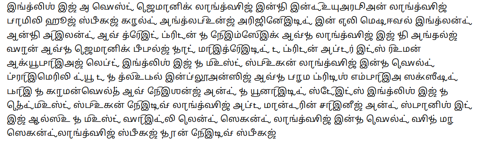
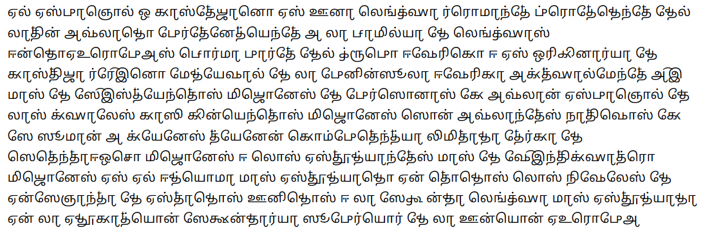

# Chakreshvari Tamil Phonetic Font

A Tamil-based phonetic font similar to that of the International Phonetic Alphabet (IPA) with various phonetic extensions to transcribe a wide range of non-native phonemes in a Tamil-esque script.

See: https://www.virtualvinodh.com/projects/chakreshvari & https://uchcharaka.aksharamukha.com/transcriber

# Sample

## English (UK) Transcription

English is a West Germanic language in the Indo-European language family, whose speakers, called Anglophones, originated in early medieval England on the island of Great Britain. The namesake of the language is the Angles, one of the Germanic peoples that migrated to Britain after its Roman occupiers left. English is the most spoken language in the world, primarily due to the global influences of the former British Empire (succeeded by the Commonwealth of Nations) and the United States. English is the third-most spoken native language, after Mandarin Chinese and Spanish; it is also the most widely learned second language in the world, with more second-language speakers than native speakers.

ɪŋɡlɪʃ ɪz ɐ wɛst dʒɜːmanɪk laŋɡwɪdʒ ɪnðɪ ɪndəʊjʊəɹəpiən laŋɡwɪdʒ famɪli huːz spiːkəz kɔːld aŋɡləfəʊnz əɹɪdʒɪneɪtɪd ɪn ɜːlɪ mɛdɪiːvəl ɪŋɡlənd ɒnðɪ aɪlənd ɒv ɡɹeɪt bɹɪtən ðə neɪmseɪk ɒvðə laŋɡwɪdʒ ɪz ðɪ aŋɡəlz wɒn ɒvðə dʒɜːmanɪk piːpəlz ðat maɪɡɹeɪtɪd tə bɹɪtən aftəɹ ɪts ɹəʊmən ɒkjuːpaɪəz lɛft ɪŋɡlɪʃ ɪz ðə məʊst spəʊkən laŋɡwɪdʒ ɪnðə wɜːld pɹaɪmɛɹɪli djuː tə ðə ɡləʊbəl ɪnfluːənsɪz ɒvðə fɔːmə bɹɪtɪʃ ɛmpaɪə səksiːdɪd baɪ ðə kɒmənwɛlθ ɒv neɪʃənz and ðə juːnaɪtɪd steɪts ɪŋɡlɪʃ ɪz ðə θɜːdməʊst spəʊkən neɪtɪv laŋɡwɪdʒ aftə mandəɹɪn tʃaɪniːz and spanɪʃ ɪt ɪz ɔːlsəʊ ðə məʊst waɪdli lɜːnd sɛkənd laŋɡwɪdʒ ɪnðə wɜːld wɪð mɔː sɛkəndlaŋɡwɪdʒ spiːkəz ðɐn neɪtɪv spiːkəz

## Spanish (Spain) Transcription

El español o castellano es una lengua romance procedente del latín hablado, perteneciente a la familia de lenguas indoeuropeas. Forma parte del grupo ibérico y es originaria de Castilla, reino medieval de la península ibérica. Actualmente, hay más de 600 millones de personas que hablan español, de las cuales casi 500 millones son hablantes nativos, que se suman a quienes tienen competencia limitada (cerca de 78 millones) y los estudiantes (más de 24 millones). Es el idioma más estudiado en todos los niveles de enseñanza de Estados Unidos y la segunda lengua más estudiada en la educación secundaria superior de la Unión Europea. El español es la cuarta lengua más estudiada del mundo con 24 millones de alumnos.

el espaɲol o kast̪eʎano es una lɛŋɡwa ɾɾomanθe pɾoθeðɛnt̪e ðel lat̪in aβlaðo peɾt̪eneθjɛnt̪e a la familja ðe lɛŋɡwas ind̪oeʊɾopeas foɾma paɾt̪e ðel ɣɾupo iβeɾiko i es oɾixinaɾja ðe kast̪iʎa ɾɾeɪno meðjeβal ðe la peninsula iβeɾika akt̪walment̪e aɪ mas ðe seɪsθjent̪os miʎones ðe peɾsonas ke aβlan espaɲol d̪e las kwales kasi kinjɛnt̪os miʎones son aβlant̪es nat̪iβos ke se suman a kjenes t̪jenen kompet̪ɛnθja limit̪aða θeɾka ðe sɛt̪ɛnt̪aiotʃo miʎones i los est̪uðjant̪es mas ðe βeɪnt̪ikwat̪ɾo miʎones es el iðjoma mas est̪uðjaðo en t̪oðos los niβeles ðe enseɲanθa ðe est̪aðos uniðos i la seɣund̪a lɛŋɡwa mas est̪uðjaða en la eðukaθjon sekund̪aɾja supeɾjoɾ ðe la unjon eʊɾopea

