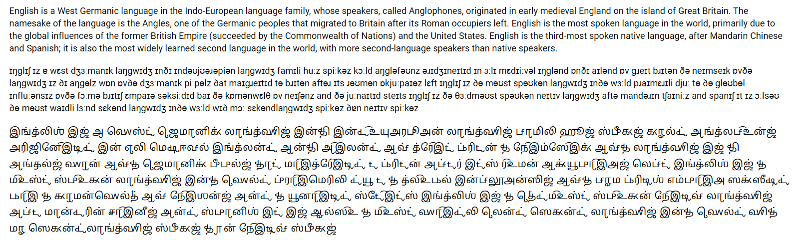
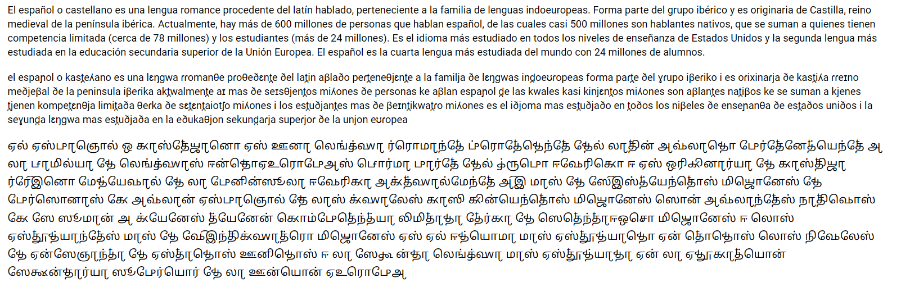

# Chakreshvari Tamil Phonetic Font

A Tamil-based phonetic font similar to that of the International Phonetic Alphabet (IPA) with various phonetic extensions to transcribe a wide range of non-native phonemes in a Tamil-esque script.

See: https://www.virtualvinodh.com/projects/chakreshvari & https://uchcharaka.aksharamukha.com/transcriber

# Sample

